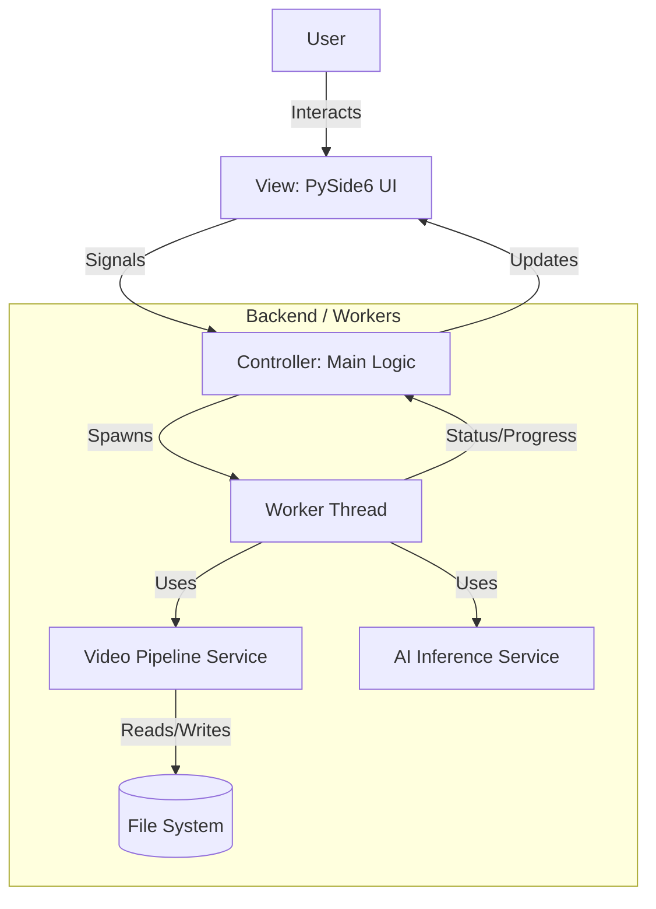
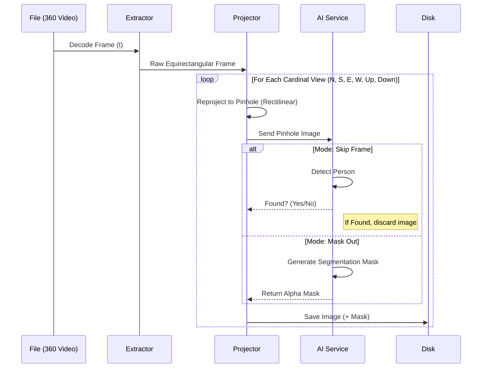

# Software Architecture & Technical Specifications: 360° Video Preprocessor

## 1. Executive Summary
This document outlines the technical design for a high-performance desktop application dedicated to preprocessing 4K-8K 360° video files. The application prepares datasets for Gaussian Splatting and photogrammetry pipelines (COLMAP, RealityScan) by converting equirectangular footage into optimized, overlap-controlled rectilinear pinhole views, while simultaneously cleaning the data using AI to remove the operator.

**Key Constraints:**
- **Cross-Platform:** Primary support for macOS (Apple Silicon), portable to Windows 11.
- **Performance:** Efficient handling of 4K-8K video files via batch processing.
- **Output:** High-quality image datasets with configurable overlap (70-80%).

---

## 2. Technology Stack Selection

### Core Framework: Python 3.10+ & PySide6 (Qt)
**Justification:**
- **Cross-Platform:** Qt offers the most robust cross-platform UI framework, ensuring the application looks native on both macOS and Windows.
- **Ecosystem:** Python is the native language of Computer Vision and AI. Direct integration with OpenCV, NumPy, and PyTorch avoids the complexity of bridging different languages (like Swift -> Python).
- **Development Speed:** Rapid prototyping and rich library support.

### Libraries & Dependencies
| Component | Technology | Reasoning |
|-----------|------------|-----------|
| **UI Framework** | **PySide6** | Modern Qt bindings for Python, supports dark mode, high-DPI displays, and custom styling. |
| **Video Processing** | **OpenCV (cv2) + FFmpeg** | Industry standard for decoding/encoding. FFmpeg (via `ffmpeg-python` or subprocess) handles high-efficiency codecs (H.265/HEVC). |
| **Math/Array Ops** | **NumPy** | Essential for vectorized matrix operations required in the re-projection algorithms. |
| **AI/ML** | **YOLOv8 (Ultralytics)** | State-of-the-art object detection. Lightweight, fast inference on Apple Silicon (via MPS) and NVIDIA GPUs (CUDA). Excellent for detecting "person" class. |
| **Concurrency** | **QThread (Qt)** | Native Qt threading prevents UI freezing during heavy batch processing loops. |

---

## 3. System Architecture

The application follows a **Model-View-Controller (MVC)** architectural pattern to separate concerns.



### Component Breakdown

#### A. View (UI Layer)
- **MainWindow:** The primary container.
- **DragDropZone:** Custom widget for intuitive file ingestion.
- **PreviewWidget:** Displays a *downsampled* version of the processed frame to maintain UI responsiveness.
- **SettingsPanel:** Controls for:
    - Output Resolution (e.g., 2K, 4K)
    - Field of View (FOV)
    - Overlap Percentage
    - AI Mode (Mask vs. Skip)

#### B. Controller (Logic Layer)
- **AppController:** Manages application state.
- **JobQueue:** Handles the list of videos to process.
- **SignalManager:** Routes events between the Worker threads and the UI (e.g., `progress_updated`, `error_occurred`, `job_finished`).

#### C. Model (Processing Layer)
- **VideoProcessor:** Handles the complex math of re-projection.
- **FrameExtractor:** Decodes video frames at specific intervals.
- **InferenceEngine:** Wraps the YOLOv8 model for detection and mask generation.

---

## 4. Video Pipeline & Algorithms

### 4.1. Data Flow



### 4.2. Algorithm: Equirectangular to Rectilinear Reprojection

To generate standard "flat" images from a 360° sphere, we map pixels from the target rectilinear image (pinhole) back to the source equirectangular image.

**Mathematical Logic (Vectorized via NumPy):**

1.  **Define Target Plane:**
    - Create a meshgrid of pixel coordinates $(u, v)$ for the target image of size $W \times H$.
    - Convert $(u, v)$ to normalized camera coordinates $(x, y, z)$ based on the desired Field of View (FOV).
    $$ x = (u - c_x) / f_x $$
    $$ y = (v - c_y) / f_y $$
    $$ z = 1 $$

2.  **Rotate Camera:**
    - Apply a rotation matrix $R$ (derived from Yaw, Pitch, Roll) to the normalized vectors to point the "camera" in the desired direction (e.g., Front, Right, Back, Left, Up, Down).
    $$ \vec{v}_{rot} = R \cdot \vec{v}_{norm} $$

3.  **Convert to Spherical:**
    - Convert rotated vectors $(x', y', z')$ to spherical coordinates $(\theta, \phi)$ (Longitude, Latitude).
    $$ \theta = \arctan2(x', z') $$
    $$ \phi = \arcsin(y' / \sqrt{x'^2 + y'^2 + z'^2}) $$

4.  **Map to Equirectangular UV:**
    - Map $(\theta, \phi)$ to the source image pixel coordinates $(U_{src}, V_{src})$.
    $$ U_{src} = (\theta / (2\pi) + 0.5) \times \text{SourceWidth} $$
    $$ V_{src} = (\phi / \pi + 0.5) \times \text{SourceHeight} $$

5.  **Remap:**
    - Use `cv2.remap` to interpolate pixel values from the source frame to the target frame using the calculated maps.

### 4.3. Overlap & Frame Extraction Strategy
To ensure 70-80% overlap for photogrammetry:
- **Spatial Overlap:** Defined by the FOV of the pinhole cameras. For a 90° FOV, extracting 4 horizontal views (Front, Right, Back, Left) provides edge overlap. Increasing extraction to 6 or 8 horizontal angles increases overlap.
- **Temporal Overlap:** Defined by the extraction frame rate.
    - *Formula:* `FrameInterval = VideoFPS * (1 - DesiredOverlap)`
    - *Example:* 30 FPS video, 80% overlap needed -> Extract every $30 \times (1 - 0.8) = 6$ frames.

---

## 5. AI Module Specification

- **Model:** `yolov8n-seg.pt` (Nano Segmentation) or `yolov8s-seg.pt` (Small).
    - *Reason:* Extremely fast inference. We only need to find people, which is a primary class in COCO.
- **Processing Logic:**
    1.  Run inference on the *rectilinear* cut, not the full 360 sphere (avoids distortion issues affecting detection).
    2.  **Mode A (Clean):** If `class == 'person'` confidence > threshold, discard the file.
    3.  **Mode B (Mask):** If `class == 'person'`, generate a binary mask. Save mask as a separate PNG or in the Alpha channel of the image.

---

## 6. Project Directory Structure

```text
360Extractor/
├── src/
│   ├── main.py                 # Entry point
│   ├── ui/                     # Presentation Layer
│   │   ├── __init__.py
│   │   ├── main_window.py
│   │   ├── widgets.py          # Custom widgets (DropZone)
│   │   └── styles.qss          # Qt Stylesheet
│   ├── core/                   # Business Logic
│   │   ├── __init__.py
│   │   ├── processor.py        # Video pipeline logic
│   │   ├── geometry.py         # Math for projections
│   │   └── ai_model.py         # YOLO wrapper
│   └── utils/
│       ├── __init__.py
│       ├── file_manager.py     # File I/O
│       └── logger.py
├── assets/                     # Icons, static images
├── models/                     # YOLO weights
├── requirements.txt
├── README.md
└── ARCHITECTURE.md
```

## 7. Next Steps for Implementation (Todo)
1.  **Setup Environment:** Initialize Python venv, install PySide6, OpenCV, Ultralytics.
2.  **Core Prototype:** Implement `geometry.py` to prove the projection math works correctly.
3.  **UI Skeleton:** Build the Main Window with Drag & Drop.
4.  **Integration:** Connect the video reader to the re-projection logic.
5.  **AI Layer:** Add the YOLO filtering step.
6.  **Threading:** Move processing to QThread to prevent UI freeze.