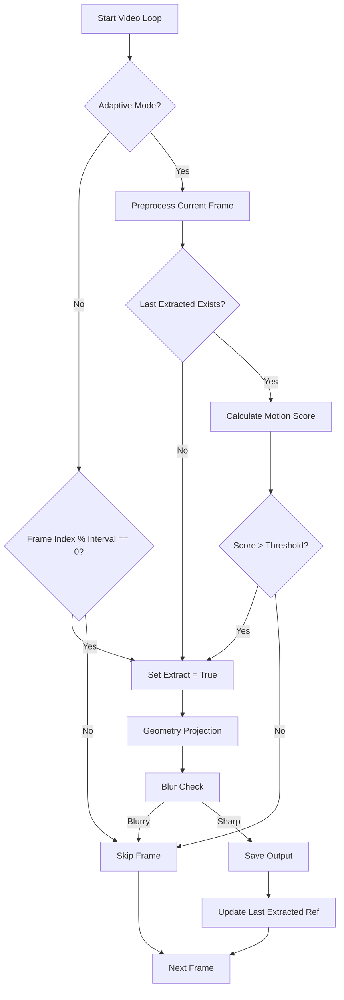

# Intelligent Keyframing (Adaptive Extraction) Architecture

## Overview
This feature introduces an "Adaptive Mode" to the video processing pipeline. Instead of extracting frames at a fixed time interval, the system will analyze the visual difference (motion) between the current frame and the last *successfully extracted* frame. This ensures that redundant frames (stationary camera) are skipped, and rapid movements are captured, optimizing the dataset for photogrammetry/NeRF.

## Components

### 1. Motion Detector Module (`src/core/motion_detector.py`)
A new class responsible for quantifying motion between two frames.

*   **Class:** `MotionDetector`
*   **Responsibilities:**
    *   Preprocessing frames (Resizing, Grayscale) for performance.
    *   Calculating motion metrics using selectable algorithms.
*   **Algorithms:**
    *   `optical_flow`: Uses `cv2.calcOpticalFlowFarneback`. Calculates the average magnitude of flow vectors.
        *   *Pros:* Robust to lighting changes, detects geometric displacement well.
        *   *Cons:* Slower than simple diff.
    *   `pixel_diff`: Uses `cv2.absdiff` and `cv2.threshold`. Calculates percentage of changed pixels.
        *   *Pros:* Extremely fast.
        *   *Cons:* Sensitive to noise and global lighting shifts.
*   **Key Methods:**
    *   `preprocess(frame)`: Resizes to a small working resolution (e.g., 320x240) and converts to grayscale.
    *   `calculate_motion(current_processed, last_processed)`: Returns a float score.

### 2. Processing Loop Integration (`src/core/processor.py`)
The `ProcessingWorker` will be modified to support the adaptive logic.

*   **Logic Flow:**
    1.  Initialize `MotionDetector` if `adaptive_mode` is enabled.
    2.  Maintain `last_extracted_view` (the preprocessed version of the last frame that was actually saved).
    3.  For each frame in video:
        *   **If Adaptive:**
            *   Preprocess current frame.
            *   If `last_extracted_view` is None (First frame):
                *   `should_extract = True`
            *   Else:
                *   `motion_score = detector.calculate_motion(current, last)`
                *   `should_extract = motion_score > threshold`
        *   **If Fixed Interval (Legacy):**
            *   `should_extract = (frame_idx % interval == 0)`
        *   **Extraction:**
            *   If `should_extract` is True:
                *   Perform Geometry Projection.
                *   Perform Blur Detection.
                *   Perform AI Analysis.
                *   **If Passed All Checks:**
                    *   Save Images.
                    *   Update `last_extracted_view = current_preprocessed`.
                    *   (Crucial: Only update reference if we *saved* the frame. If it was blurry, we keep the old reference so we still look for motion relative to the last *good* frame).

### 3. Configuration (`JobConfig`)
New settings to be added to `JobConfig` (and passed via `settings` dict):

*   `adaptive_mode` (bool): Enable/Disable.
*   `adaptive_threshold` (float): Sensitivity.
    *   For Optical Flow: Interpretation is "Average pixel displacement". Value range ~0.5 to 5.0.
    *   For Diff: Interpretation is "% of pixels changed".
*   `adaptive_method` (str): 'optical_flow' (default) or 'pixel_diff'.

## Integration Diagram

